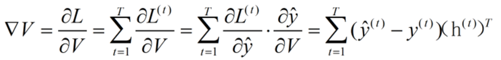
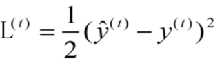
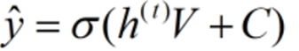
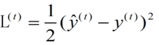
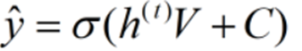
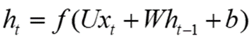
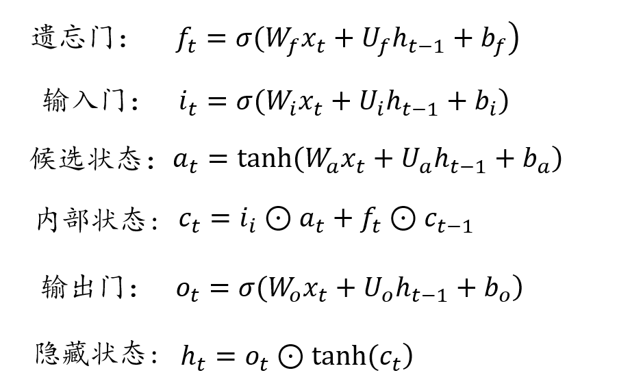

## 深度学习
id:: 6507b269-db85-47d2-92b0-7babb52cd62d
	- ### 基本概念
		- 深度学习本质上是一个多层（三层以上）神经网络，从数据中学习，利用数据输入，权重与偏差来模拟人脑。
		- **与机器学习**  属于机器学习
			- 主要区别在 深度学习的数据输入不一定要结构化（虽然机器学习也不用，但其需要化非结构化为结构化，此时需要堆数据的预处理） 而深度学习可以消除一部分相关的预处理，自动提取特征。 #结构化数据
			- 机器学习主要是有人类来确定特征，而深度学习是赋予权重，由算法筛选来确定特征
		- **深度**
			- 即神经网络的层数，多层于是叫深度学习
		- #### 时间步
		  id:: 651815b7-7528-48a6-908e-5f95b8d51c26
			- 对于 某一时间 的观察结果
			- 时间步的值是这一时间 处理数据的数量，称为时间步数
		- #### 隐藏层
			- 中间层
			- 作用是将数据特征抽象到另一个维度空间，展示更抽象的特征，可以做更好的线性划分。
			- 每一层是一次特征的抽象，多层即多次抽象，实现对数据更好的划分，更详细的划分
		- #### 前向传播
			- 将输入数据通过网络的权重和 **激活函数** 计算出输出结果的过程
			- 一般 神经网络的数据传递方向是向输出层传递，称这个方向的传播为 前向
		- #### 反向传播
			- 将输出结果和真实标签对比，更加 **链式法则** 计算网络中每个权重和偏置的 **梯度** ，并根据梯度更新参数，来减少误差
			- 称反向是因为与基础计算的方向不同，相当于负反馈
	- >>经典算法
	- ### CNN 卷积神经网络
	  collapsed:: true
		- 对于图像识别的计算机对人类视觉的模拟实现
		- 人类视觉实际上是
			- 从边缘获取特征
			  logseq.order-list-type:: number
			- 逐层叠加特征
			  logseq.order-list-type:: number
			- 合成眼前图像
			  logseq.order-list-type:: number
			- 的过程，CNN通过神经网络来模拟
		- #### 具体实现
			- 通过 **过滤器** （卷积核）filter
				- 卷积核是一块由0 1 数据组成的人为设定的特征集，其在识别的图像中与图像叠放，将图像的 01 数据与其 01 数据进行运算，做到提取相关的信息
				- 通常有多种不同卷积核，识别不用特征（模拟人识别多个边缘数据）
				- #### 具体
					- 卷积所包含的是图像的处理
					- 一般的图像处理是 通过矩阵实现的，
						- ？？？
						- 图像有长宽与深度
							- 长宽指分辨率
							- 深度是其颜色的区分，若有三原色构成，则是深度为3，若为高色谱则深度提高
					- **步长**  卷积核移动的距离
					- **填充**
						- 区别于卷积的另一项图像处理技术，此处都并在卷积层
						- 此处的填充主要方便卷积核的移动，因为卷积核的大小是确定的，图像的大小也是确定的，卷积核的移动不一定刚好符合图像的大小，此时在图像的四周填上一层全为 0 的填充层，不影响特征提取，同时满足步长
			- 池化层
				- 用于 **降维**
				- 不管是图像原本数据还是卷积数据都太大，难以运算合成，于是通过与卷积类似的算法（或者与压缩类似的方法 如赫夫曼树）将数据压缩，方便运算的网络
				- #### 具体
					- 池化分为平均池化与最大池化
			- 全连接层
				- 实现提取数据的合成与相关处理
			- 一般的卷积通过多次卷积，池化的重复过程来尽可能地提取特征并减少数据，再通过全连接层合成
	- -------------
	- ### RNN  循环神经网络
		- #### 特征
			- 处理 **序列特性** 的数据，挖掘时许与语义之类的信息。
			- #### 序列特性
				- 符合某种顺序的数据，如时间顺序，逻辑顺序，数据与数据间有一定的 序列性（前面影响后面） 的关系
		- 解决 _整体的数据影响单个数据的含义_  的问题
			- 一般的神经网络的神经元是相对独立，没有联系的，对于输入数据特征的抽象不会影响到其它对其他数据的抽象。
			- 这意味着 当 **数据前后有联系的时候**，这种联系体现不出。
				- 如 同词不同义，错别字理解等
		- #### 基本概念
			- 使用 已输入数据经隐藏层处理后的值，加权后来影响后输入的数据。
			- {:height 189, :width 690}
			- 在 ((651815b7-7528-48a6-908e-5f95b8d51c26)) t，经神经元处理后获得了受到前面所有时间步影响的 **隐藏状态** $$h_t$$ ，再将此隐藏状态 $$h_{t+1}$$ 作为新的隐藏状态来影响之后的处理
		- #### 具体结构与实现
			- _多对一_    多输出对一输入（句子视频）
			- _一对多_   一输入对多输出 （图像） 输出为处理数据（如文字）
			- _多对多_   等长$$(N 对 N)$$数据或不等长$$(N 对 M)$$输入输出
				- Encoder-Decoder 模型， 又称 Seq2Seq 模型
		- #### 前向传播
			- 计算当前的隐藏状态 $$h^{(t)} = \sigma(Ux^{(t)} + Wh{(t-1)} + b）$$
			- 计算输出 $$o^{(t)} = Vh^{(t)} + c$$
			- 计算当前的预测输出 $$\hat{y}^{(t)} = \sigma(o^{(t)}) $$
		- #### 反向传播
			- 负反馈
			- 使用参数是相同且共用的参数
			- **步骤**   寻优
				- 利用 ((65182a38-3276-4436-8556-30f097fd7c65)) 一轮轮迭代，找到合适的RNN参数 $$U, V, W$$
				- 利用反向传播算法将输入层误差加和，对各个权重的参数矩阵求梯度
				- 梯度下降法更新权重
			- 实现  误差$$L$$对参数的梯度
				- 对于 V
					- 每个时刻的简单求导的加和，不涉及到之前状态的函数
					- {:height 65, :width 421}
					- {:height 44, :width 123}             {:height 64, :width 125}
				- 对于W
					- 涉及到之前状态的函数，链式法则求导（对外求导再对内求导），一直展开到 $$h^{(1)}$$
					- {:height 49, :width 123}       
					   {:height 28, :width 111}  
					  {:height 41, :width 149}
					- 之后再加和，得到梯度。
				- 对于U
					- 与W同理
				- 将参数更新为      _新参数 = 旧参数 - 学习率 * 其梯度_
				-
		- #### 短期记忆
			- **梯度爆炸 与 梯度消失**
				- 由于反向传播，导致网络的后层中梯度逐渐变小，影响网络的训练效果
				- 当梯度很小时，如小于1，且每层都小于1，链式法则在计算梯度时，会越算越小，那对与靠近输入层（先输入的信息）的权重会变得很小，难以学习到较长历史的数据
					- 称为 **梯度消失**
				- 若是相反，每层都大于1，相乘后梯度指数级增长，导致权重变化幅度大，学习不稳定。
					- 称为 **梯度爆炸**
					- {:height 193, :width 252}
					-
		- ### LSTM     Long short-term memory
			- 特征
				- _长期记忆性_  与  _短期记忆性_
					- 设计者提出  不是所有的信息都是等效的，存在一些信息在数据集中起到关键作用，而有些信息则相对无用，此时只有一部分信息需要长期记忆，而一部分不用
				- 相对RNN的短期记忆，可以处理长序列的数据，不至于丢失信息
			- #### 新增
				- #### 门
					- 解决梯度的两个问题
					- 筛选信息来改变记忆细胞  _Memory Cell_ （存储每一时刻信息的地方）状态
					- **分类**    输入 ->  遗忘 ->  输出
					- **Input Gate**     输入门首先接收到输入信息，其开闭状态决定信息是否输入到记忆细胞
					- **Output Gate**    决定是否将细胞信息输出
					- **Forget Gate**     决定是否遗忘细胞中的数据
					- {:height 456, :width 332}
			- #### 激活函数
				- 将数据做某种运算来后，判断或使其满足某种条件，再进入网络学习
				- 门的开闭与输入数据都由激活函数影响
				- LSTM  有两个常用的激活函数
					- 分别是$$tanh()$$ 和 $$\sigma()$$  （不是sigma 而是 sigmoid）
					- 有 $$sigmoid$$ 函数可以将数据压缩到 $$(0, 1)$$ 之间，对于遗忘门 与 记忆门（输入与状态），这决定了记录多少，因为函数运算的参数有之前的输出与隐藏状态，所以同时会选择**重要信息**存储下来
					- 有 $$tanh$$ 函数可以将数据变为$$(-1, 1)$$解决Sigmoid函数的输出不以0为中心的问题，使得神经网络的收敛速度更快
			- #### 前向传播
				- {:height 250, :width 385}
					- Hadamard 积  就是对应元素分别相乘
				- 输入数据经过不同的门与权重，偏置做运算，再经过激活函数得到相应的结果
				- #### 对于图的详解
				- {:height 556, :width 640}
				- 每一个蓝色单元是一个隐藏层，每一个隐藏层内有隐藏单元（神经元），其特征数量（hidden_size）就是其维度（多少个），决定了能同时处理多少个数据
				- 横向传播是 隐藏层 层间的传播
				- 纵向传播是 LSTM层 层间的传播
			- #### 反向传播
				- #### 损失函数
					- 由于是矩阵的运算，梯度计算复杂
						- Hadamard积 求偏导时的计算是类似与相加的
					- 更新方式依旧是 梯度下降法
			- #### 缺点
				- 由于计算量对比一般的RNN较大，传递过程更复杂，运行速度较慢
	- >计算方法
	- ### 优化算法
		- #### 梯度下降法
		  id:: 65182a38-3276-4436-8556-30f097fd7c65
			- 迭代搜索来逼近函数的最小值点
			- 在每一步迭代中，沿梯度的反方向，按一定 **步长** 更新参数
			- 损失函数 $$loss >= 0$$
			- **步骤**
				- 初始化参数和学习率（步长）
				- 计算损失函数（需要优化的函数）的关于参数的梯度
				- 更新参数为  **新参数 =  原参数 - 学习率 * 梯度**
				- 重复迭代，直到满足停止的准则（预设的迭代次数或梯度接近0）
			- #数学
			-
			-
	- >学习误差
	- ### 过拟合
		-
	- >深度学习领域
	- ### NLP 自然语言处理
		- 自然语言处理（NLP）是一种让计算机理解和解析人类语言的技术。它包括两个主要任务：自然语言理解（NLU）和自然语言生成（NLG）¹²。
		  
		  NLP面临的一些挑战包括：
		- 语言的多样性：不同的语言有不同的语法和词汇¹。
		- 语言的歧义性：同一个词在不同的上下文中可能有不同的含义¹⁵。
		- 语言的鲁棒性：即使有拼写或语法错误，人们仍然可以理解句子的含义¹。
		- 语言的知识依赖：理解某些句子需要特定的背景知识¹。
		- 语言的上下文：句子的含义可能取决于前后文¹。
		  
		  NLP的一些应用包括：
		- 情感分析：确定文本的情绪倾向，如正面或负面¹。
		- 聊天机器人：通过理解和生成自然语言与用户交流¹。
		- 语音识别：将人类的声音转化为文字¹。
		- 机器翻译：将一种语言的文本翻译成另一种语言¹。
		  
		  NLP实践步骤通常包括：
		- 语料预处理：如分词、词干提取、词形还原、词性标注、命名实体识别等¹²。
		- 特征工程：包括特征提取和特征选择¹。
		- 选择分类器和设计模型¹。
		- 模型训练¹。
		-
		-